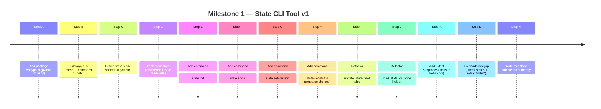
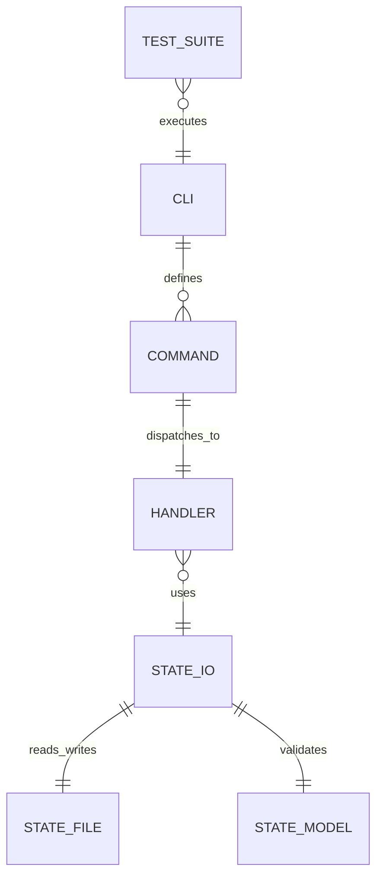

# Milestone 1 Self-Study Pack — AI_SYSTEM_BUILDER

## What this pack is

This is the enhanced self-learning version of your Milestone 1 booklet.  
Its job is not only to **explain** Milestone 1, but to help you **learn it actively** until you can:

- read the code confidently
- explain every major line and syntax choice
- reproduce the CLI structure from memory
- understand why each refactor happened
- diagnose mistakes when something breaks
- teach the milestone back in your own words

Use this pack in two modes:

1. **Learning mode**  
   Read slowly, section by section, and answer the active recall prompts before looking back at the code.

2. **Revision mode**  
   Use the checkpoints, summary sheets, and mini-drills to refresh quickly before continuing to Milestone 2.

---

## How to use this pack

Read in this exact order:

1. **Mastery Map**
2. **Self-Study Journey**
3. **Core Vocabulary**
4. **Milestone 1 Story**
5. **Deep Reference Booklet**  
6. **Active Recall + Drills**
7. **Final Mastery Checklist**

Do not try to memorize code first.  
First understand:

- what layer the code belongs to
- what problem it solves
- why it is written that way
- what would break if it were removed

Then memorize the shape.

---

## Mastery Map

By the end of this pack, you should be able to explain these clearly:

### Layer 1 — Python / project structure
- What is a script?
- What is a module?
- What is a package?
- Why does `python -m asbp` work?
- What is `__main__.py` doing?

### Layer 2 — CLI architecture
- What is a CLI?
- What is `argparse`?
- What does “parse” mean?
- What are arguments?
- What is `args`?
- What is a namespace?
- What are subcommands?
- What is a handler?
- What is dispatch?

### Layer 3 — state and persistence
- What is runtime state?
- Why store it in JSON?
- Why validate before trusting the file?
- What is persistence?
- What is mutation?
- Why is safe loading separate from mutation?

### Layer 4 — validation
- What does Pydantic do?
- What is `BaseModel`?
- What is `ValidationError`?
- What is `Literal[...]`?
- What is `ConfigDict(extra="forbid")`?
- Why do we need parser-level validation **and** model-level validation?

### Layer 5 — refactoring
- Why was the first version acceptable?
- Why did duplication become a problem?
- Why was `update_state_field(...)` extracted?
- Why was `load_state_or_none()` extracted?
- What does “thin handlers” mean?

### Layer 6 — testing
- Why test through subprocess instead of calling functions directly?
- Why use `sys.executable`?
- Why use `python -m pytest`?
- What exactly do the 8 tests guarantee?

---

## Self-Study Journey

### Stage A — Understand the big picture
Objective: know what Milestone 1 built.

You built a **package-based local CLI** that can:

- create a state file
- show the current state
- update the version
- update the status
- validate the state
- handle common file problems safely
- verify behavior with tests

This milestone exists because the roadmap says Milestone 1 should create the first deterministic local backbone: package structure, CLI entry, state handling, validation, and first tests. fileciteturn0file1

### Stage B — Understand the control flow
Objective: follow the journey from terminal command to result.

When you run a command like:

```powershell
python -m asbp state show
```

the flow is:

1. Python runs the package as a module
2. `__main__.py` calls `main()`
3. `build_parser()` creates the command tree
4. `parse_args()` reads the words you typed
5. `args.func` points to the correct handler
6. the handler loads or mutates state
7. the CLI prints a result

### Stage C — Understand the design choices
Objective: know why the code is shaped this way.

The milestone intentionally separates:

- **parsing**
- **dispatch**
- **loading**
- **validation**
- **mutation**
- **saving**
- **printing**
- **testing**

That separation is not decoration.  
It is the first engineering habit of the whole program.

### Stage D — Understand the refactors
Objective: see why “working code” was not enough.

At first, repetition was acceptable because it helped you understand the pattern.

Later, once the pattern became clear, duplication became a liability.  
That is why you extracted:

- `update_state_field(...)`
- `load_state_or_none()`

This is the first time the project moved from:
- “command works”
to:
- “architecture is forming”

---

## Core Vocabulary — Plain-English Meanings

### Parse
To take raw input text and interpret it into meaningful structure.

### Parser
The object that knows the allowed structure of command-line input and turns it into usable Python values.

### Argument
A piece of information passed to a program from the terminal.

### `args`
A common variable name for the object returned by `parse_args()`.  
It is short for “arguments”.

### Namespace
An object that stores values as attributes, like:

```python
args.command
args.state_command
args.status
```

### Command
A word or phrase the user types to ask the CLI to do something.

### Subcommand
A nested command under another command, such as:

- `state init`
- `state show`
- `state set-version`
- `state set-status`

### Handler
The Python function that actually performs the work for a command.

### State
The current structured data the program depends on.

### Runtime state
The state that exists while the system is being used and can change over time.

### Persistence
Saving data so it is still there the next time the program runs.

### Mutation
Changing existing data.

### Validation
Checking whether data matches rules.

### Refactor
Changing code structure without changing intended behavior.

### Thin handler
A handler that does very little by itself and delegates repeated logic to helpers.

---

## Milestone 1 Story — One clean narrative

Milestone 1 started with a very small but important goal: build the first real package-based CLI for the project. The project instructions and roadmap frame this phase as the foundation for deterministic systems thinking, not just random scripts. fileciteturn0file3 fileciteturn0file4

So you first established the Python package structure and verified that the package could run through:

```powershell
python -m asbp
python -m asbp --version
```

That aligned with the project setup notes and the roadmap’s early sequence around package/module understanding and CLI grounding. fileciteturn0file5 fileciteturn0file1

Then you built the CLI tree using `argparse`, added the `state` command group, and gradually introduced real commands:

- `state init`
- `state show`
- `state set-version`
- `state set-status`

Next, you moved from simple command behavior into real persisted state by reading and writing a JSON file under `data/state/state.json`.

Then you hardened correctness with Pydantic validation, safe file handling, and parser-level restrictions.

Then you improved the architecture by extracting shared helpers.

Then you proved the behavior with tests.

That is why Milestone 1 is not “just a CLI”.  
It is the first real skeleton of the whole AI Systems Builder journey.

---

## How to study line-by-line code properly

For each code block in the reference section below, study it in this order:

1. **What layer is this?**
   - entrypoint?
   - parser?
   - model?
   - IO?
   - tests?

2. **What is this line doing literally?**

3. **Why is it here?**

4. **What would happen if we removed it?**

5. **Is this business logic, control flow, validation, or plumbing?**

If you can answer those 5 questions for a line, you understand it properly.

---

## Deep Reference Booklet

Everything below is the detailed reference booklet. Read it slowly and use the active recall section after each chunk.


# Milestone 1 Lesson Booklet for AI_SYSTEM_BUILDER

## Executive Summary

Milestone 1 (“State CLI Tool v1”) established a stable, test-backed command-line workflow for managing the project’s runtime state as a JSON file. The core deliverable is a package-executed CLI (`python -m asbp`) that can initialize, display, and update a persisted state file while handling missing files, invalid JSON, and schema validation failures gracefully. This milestone also introduced intentional refactoring patterns—small shared helpers that keep handlers thin and reduce duplication—plus a subprocess-based test suite that verifies user-visible behavior end-to-end.

This booklet emphasizes two complementary validation layers: parser-level constraints (for immediate feedback and preventing bad CLI input) and model-level constraints (for guaranteeing persisted state correctness even if files are manually edited). In `argparse`, `parse_args()` converts command-line input into a populated namespace-like object whose attributes come from previously declared arguments. citeturn2search1 In Pydantic, invalid input triggers `ValidationError`, and configuration like `ConfigDict(extra='forbid')` turns unexpected keys into explicit failures instead of silently ignoring them. citeturn6search0turn1search0

From the Coursera connector, the most relevant match was a lecture titled **“Introduction to Software Testing”** from a course focused on using Python with OS facilities (notably file handling and subprocesses), which aligns directly with this milestone’s file persistence and subprocess-driven CLI testing. A targeted Coursera query for argparse subparsers did not return a relevant lecture in this connector session (marked as unavailable in this booklet).

Important limitation: the live repository files (`asbp/cli.py`, `asbp/state_model.py`, etc.) were not accessible for direct inspection in this chat session, so the “Exact file content blocks” below are **reconstructed from the milestone steps and the test specifications discussed in-session**. If any line differs from your repo, treat the reconstructions as a high-confidence template and prefer your repository as the ultimate source of truth.

## Files Inspected and Included in This Booklet

Because the repository was not directly readable in-session, the table below lists (a) files that are *required by Milestone 1*, (b) files that were explicitly referenced/used by the milestone and tests, and (c) which items are *reconstructed* vs. *unspecified*.

### File inventory and purpose table

| File | Purpose in Milestone 1 | Status in this booklet |
|---|---|---|
| `asbp/__main__.py` | Package entrypoint so `python -m asbp` works | Reconstructed |
| `asbp/cli.py` | CLI parser construction, dispatch, handlers, shared helpers (`load_state_or_none`, `update_state_field`) | Reconstructed |
| `asbp/state_model.py` | Pydantic model (`StateModel`) enforcing strict schema (`Literal` + `ConfigDict(extra='forbid')`) | Reconstructed |
| `asbp/state_io.py` (name may differ) | Centralized state file path + `load_validated_state`/`save_validated_state` | Reconstructed (file name **unspecified**; content provided as recommended implementation) |
| `tests/test_state_cli.py` | End-to-end tests via subprocess invoking the CLI | Reconstructed (based on the milestone test plan) |
| `data/state/state.json` | Runtime state persistence location | Generated at runtime (not committed) |
| `docs/M1_COMPLETION_SUMMARY.md` | Milestone closure summary, created after tests passed | Unspecified (you created it; template included as reference only) |
| `docs/M1_LESSON_BOOKLET.md` | The booklet you are reading (single-file output) | This document |

## Milestone Walkthrough

This section documents each step as **What / Why / How**, followed by a suggested commit message. A key guiding idea is that every step either expands capability, tightens correctness, or reduces duplication; tests then lock behavior.

### Timeline diagram



### Step A — Package entrypoint

**What**  
Enable running the package as a module: `python -m asbp`.

**Why**  
This provides a consistent execution path without relying on installed console scripts. It also makes tests more robust: subprocess tests can call `sys.executable -m asbp ...` and be confident they are targeting the current working tree’s package.

**How**  
Create `asbp/__main__.py` and delegate to `cli.main()`.

**Suggested commit message**  
`feat(cli): add package entrypoint via asbp.__main__`

### Step B — Parser and dispatch

**What**  
Create an `argparse.ArgumentParser` root parser, attach subparsers for a `state` command group, and subcommands such as `init`, `show`, `set-version`, `set-status`.

**Why**  
`argparse` is standard-library, stable, and supports subcommands cleanly. It also provides a built-in user experience: generated help, usage, and error handling.

**How**  
Use `add_subparsers()` and bind handlers via `set_defaults(func=...)`. Then call `parser.parse_args()` to obtain an args namespace; `parse_args()` converts argument strings to objects and returns the populated namespace. citeturn2search1turn2search3

**Suggested commit message**  
`feat(cli): build argparse command tree and handler dispatch`

### Step C — State schema definition

**What**  
Create a Pydantic model `StateModel` with fields:

- `project: str`
- `version: str`
- `status: Literal["planned", "in_progress", "done"]`

and configure it with `ConfigDict(extra="forbid")`.

**Why**  
The CLI must be able to trust persisted state. Pydantic raises `ValidationError` whenever the input fails validation. citeturn6search0 Using `Literal[...]` expresses “this field must be one of these exact strings” at the type level, and Pydantic will surface a literal validation failure when violated. citeturn6search1turn7search0 `extra='forbid'` ensures unexpected keys are treated as errors rather than silently ignored. citeturn1search0turn1search1

**How**  
Implement `StateModel` in `asbp/state_model.py`.

**Suggested commit message**  
`feat(state): add strict StateModel with Literal status and extra=forbid`

### Step D — Persistence layer

**What**  
Read and write `data/state/state.json`.

**Why**  
State must survive process runs and be inspectable outside the program. JSON is human-editable and widely supported.

**How**  
Use `json.loads()` and `json.dumps()` for serialization. Invalid JSON raises `json.JSONDecodeError`, a `ValueError` subclass. citeturn3search5

**Suggested commit message**  
`feat(state): add load/save helpers for data/state/state.json`

### Step E — `state init`

**What**  
Create the state file with defaults.

**Why**  
Provides a single “bootstrap” command that establishes the correct schema and location.

**How**  
Construct `StateModel(project="AI_SYSTEM_BUILDER", version="0.1.0", status="planned")` and save.

**Suggested commit message**  
`feat(state): implement state init with default state`

### Step F — `state show`

**What**  
Print the current state as formatted JSON.

**Why**  
Makes the runtime state visible to humans and scripts.

**How**  
Load + validate state; then `json.dumps(state.model_dump(), indent=2)`.

**Suggested commit message**  
`feat(state): implement state show with validated load`

### Step G — `state set-version`

**What**  
Update only the `version` field and save.

**Why**  
Keeps evolution of state isolated and traceable.

**How**  
Load state, mutate field, save state. Then print confirmation.

**Suggested commit message**  
`feat(state): implement state set-version`

### Step H — `state set-status` with parser-level restriction

**What**  
Update only the `status` field. Restrict input using argparse `choices`.

**Why**  
Parser-level validation provides the fastest feedback to users and prevents generating invalid state via the CLI. `argparse` supports restricted values via `choices`; invalid values produce an “invalid choice” error and non-zero exit code. citeturn8search0

**How**  
`add_argument("status", choices=["planned", "in_progress", "done"])`.

**Suggested commit message**  
`feat(state): implement state set-status with argparse choices`

### Step I — Refactor: `update_state_field`

**What**  
Centralize “load → mutate one field → save” logic in a reusable helper.

**Why**  
Prevents copy/paste logic across multiple handlers and reduces bug surface.

**How**  
Create `update_state_field(field_name, new_value)` and reuse it for `set-version` and `set-status`.

**Suggested commit message**  
`refactor(state): add update_state_field helper for shared mutation`

### Step J — Refactor: `load_state_or_none`

**What**  
Centralize safe-load behavior (catch missing file, invalid JSON, validation errors).

**Why**  
Handlers should be thin. Repeating three `except` blocks in every handler increases drift risk and makes future changes error-prone.

**How**  
Wrap `load_validated_state()` and return `None` on failure after printing a friendly message.

**Suggested commit message**  
`refactor(state): add load_state_or_none to remove repeated try/except`

### Step K — Tests: subprocess-driven CLI verification

**What**  
Add `tests/test_state_cli.py` with 8 tests verifying init/show/mutations and error handling.

**Why**  
This ensures the CLI behaves correctly from the user’s perspective, including stdout/stderr and exit codes. Pytest is commonly invoked either as `pytest` or via `python -m pytest`; the docs explicitly describe invocation patterns and selection mechanisms. citeturn0search6turn0search4

**How**  
Use `subprocess.run(..., capture_output=True, text=True)` to invoke `sys.executable -m asbp ...` and assert on outputs. `subprocess.run` returns a `CompletedProcess`, and `capture_output=True` captures stdout/stderr. citeturn4search0 `sys.executable` is the absolute path of the Python interpreter, which is ideal for virtualenv correctness. citeturn5search3

**Suggested commit message**  
`test(state): add end-to-end CLI tests via subprocess`

### Step L — Fix: enforce `status` validity at model level

**What**  
Update `StateModel.status` from `str` to a `Literal[...]` and enforce `extra='forbid'`.

**Why**  
The test suite demonstrates a real-world failure mode: manually edit JSON file to an invalid status; CLI should detect and report invalid persisted state. Pydantic reports literal failures as `literal_error`. citeturn6search1turn7search0 Extra keys should similarly raise validation errors when `extra='forbid'`. citeturn1search0

**How**  
Implement both in `StateModel`.

**Suggested commit message**  
`fix(state): enforce status literals and forbid extra fields`

### Step M — Documentation closure

**What**  
Write `docs/M1_COMPLETION_SUMMARY.md`.

**Why**  
Formal closure helps continuity and future onboarding.

**How**  
Summarize delivered capabilities, tests, and final state.

**Suggested commit message**  
`docs: add Milestone 1 completion summary`

## CLI Architecture, Concepts, and Full Source Annotations

This section provides (a) definitions, (b) mermaid flowchart, (c) exact file content blocks (reconstructed), and (d) line-by-line annotations.

### CLI flowchart

```mermaid
flowchart TD
    A[User runs: python -m asbp state ...] --> B[asbp/__main__.py]
    B --> C[cli.main()]
    C --> D[build_parser()]
    D --> E[parser.parse_args()]
    E --> F{Which subcommand?}
    F -->|init| G[handle_state_init]
    F -->|show| H[handle_state_show]
    F -->|set-version| I[handle_state_set_version]
    F -->|set-status| J[handle_state_set_status]
    H --> K[load_state_or_none]
    I --> L[update_state_field]
    J --> L
    L --> K
    K --> M{State loaded & valid?}
    M -->|No| N[Print error; return code 0]
    M -->|Yes| O{Operation}
    O -->|show| P[Print JSON]
    O -->|mutate| Q[save_validated_state]
```

### Plain-language definitions of core terms

**Parse**  
To read input text (like command-line tokens) and convert it into a structured form.

**Parser**  
An object that knows what inputs are allowed and how to interpret them. In this milestone, it is an `argparse.ArgumentParser`.

**`parser.parse_args()`**  
The call that consumes command-line arguments and returns a populated namespace object. The official docs describe it as converting argument strings to objects and assigning them as attributes of a namespace; by default, it reads from `sys.argv`. citeturn2search1

**Args / arguments**  
The values the user typed on the command line, for example: `state set-status done`.

**Namespace (`args`)**  
The object returned by `parse_args()`; its attributes correspond to declared arguments. citeturn2search1

**Handler**  
A function that implements the behavior for a specific command, e.g., `handle_state_show(args)`.

**Mutation**  
A change to an object’s state in memory (e.g., setting `state.version = "0.8.0"`).

**Persistence**  
Saving data so it survives restarting the program, here `data/state/state.json`.

**Validation**  
Checking that data conforms to rules (types, allowed values, required fields, no unknown fields).

**Pydantic `BaseModel`**  
A model class that validates input data and produces structured Python objects; invalid input triggers `ValidationError`. citeturn6search0

**`ValidationError`**  
The exception Pydantic raises when validation fails. citeturn6search0

**`Literal[...]`**  
A typing construct meaning “this value must be exactly one of these literals.” The typing docs explain `Literal` as defining “literal types” to indicate one of the provided literal values. citeturn7search0

**`ConfigDict(extra='forbid')`**  
A Pydantic model configuration that raises errors if extra (undeclared) fields are provided; the Pydantic docs show it raising `ValidationError` when extra keys exist. citeturn1search0turn1search1

**JSON errors / `JSONDecodeError`**  
Raised when JSON parsing fails; Python’s `json` docs define `JSONDecodeError` as a `ValueError` subclass. citeturn3search5

### Source file: `asbp/__main__.py` (reconstructed)

```python
from .cli import main


if __name__ == "__main__":
    raise SystemExit(main())
```

#### Line-by-line annotation

| Line | Explanation |
|---:|---|
| 1 | Imports `main()` from the CLI module. |
| 4–5 | If executed as a module entrypoint, call `main()` and convert its return value into the process exit code via `SystemExit`. This is what makes `python -m asbp ...` behave like a CLI program. |

### Source file: `asbp/cli.py` (reconstructed)

```python
import argparse
import json

from pydantic import ValidationError

from .state_io import load_validated_state, save_validated_state
from .state_model import StateModel


ALLOWED_STATUSES = ["planned", "in_progress", "done"]


def load_state_or_none() -> StateModel | None:
    try:
        return load_validated_state()
    except FileNotFoundError as e:
        print(e)
        return None
    except ValidationError as e:
        print("State validation failed:")
        print(e)
        return None
    except json.JSONDecodeError as e:
        print(f"Invalid JSON in state file: {e}")
        return None


def update_state_field(field_name: str, new_value: str) -> bool:
    state = load_state_or_none()
    if state is None:
        return False

    setattr(state, field_name, new_value)
    save_validated_state(state)
    return True


def handle_state_init(args) -> None:
    state = StateModel(project="AI_SYSTEM_BUILDER", version="0.1.0", status="planned")
    save_validated_state(state)
    print("State initialized.")


def handle_state_show(args) -> None:
    state = load_state_or_none()
    if state is None:
        return

    print(json.dumps(state.model_dump(), indent=2))


def handle_state_set_version(args) -> None:
    if update_state_field("version", args.version):
        print(f"State version updated to: {args.version}")


def handle_state_set_status(args) -> None:
    if update_state_field("status", args.status):
        print(f"State status updated to: {args.status}")


def build_parser() -> argparse.ArgumentParser:
    parser = argparse.ArgumentParser(prog="asbp", description="AI_SYSTEM_BUILDER CLI")
    subparsers = parser.add_subparsers(dest="command", required=True)

    state_parser = subparsers.add_parser("state", help="Manage runtime state")
    state_subparsers = state_parser.add_subparsers(dest="state_command", required=True)

    init_parser = state_subparsers.add_parser("init", help="Initialize the state file")
    init_parser.set_defaults(func=handle_state_init)

    show_parser = state_subparsers.add_parser("show", help="Print the current state")
    show_parser.set_defaults(func=handle_state_show)

    set_version_parser = state_subparsers.add_parser(
        "set-version", help="Update the version field"
    )
    set_version_parser.add_argument("version")
    set_version_parser.set_defaults(func=handle_state_set_version)

    set_status_parser = state_subparsers.add_parser(
        "set-status", help="Update the status field"
    )
    set_status_parser.add_argument("status", choices=ALLOWED_STATUSES)
    set_status_parser.set_defaults(func=handle_state_set_status)

    return parser


def main(argv: list[str] | None = None) -> int:
    parser = build_parser()
    args = parser.parse_args(argv)

    handler = getattr(args, "func", None)
    if handler is None:
        parser.print_help()
        return 1

    handler(args)
    return 0
```

#### Line-by-line annotation

| Line(s) | Explanation |
|---:|---|
| 1–2 | Import standard libraries: `argparse` for parsing, `json` for serialization/errors. The `argparse` module is designed for user-friendly CLIs with automatic help and error messages. citeturn8search2 |
| 4 | Import Pydantic `ValidationError` to catch schema failures cleanly. Pydantic raises it when validation fails. citeturn6search0 |
| 6–7 | Import persistence helpers and the state model. The CLI is thin and delegates validation and IO. |
| 10 | `ALLOWED_STATUSES` is a single source of truth used in argparse `choices` and in documentation. Argparse “choices” restricts allowed values and produces “invalid choice” errors automatically. citeturn8search0 |
| 13–28 | `load_state_or_none()` centralizes “safe load.” It returns `None` and prints a message for: missing file, validation error, JSON parsing error. Invalid JSON triggers `JSONDecodeError`. citeturn3search5 |
| 31–39 | `update_state_field()` centralizes the mutation pattern: load → set attribute → save. It returns `False` when state could not be loaded, allowing handlers to remain simple. |
| 42–45 | `state init` handler creates defaults and writes them. |
| 48–55 | `state show` loads state and prints formatted JSON. |
| 58–60 | `set-version` uses the shared mutation helper and prints a confirmation message (required by the tests). |
| 63–65 | `set-status` similarly updates status. |
| 68–97 | `build_parser()` builds the command tree: `asbp state <subcommand>`. `parse_args()` converts argument strings to objects and returns a namespace, defaulting to `sys.argv` when `argv` is None. citeturn2search1 |
| 74–76 | `add_subparsers(..., required=True)` enforces that a subcommand must be provided. |
| 86–89 | `set-version` adds a positional `version` argument. |
| 92–94 | `set-status` adds `status` with `choices=ALLOWED_STATUSES`. Argparse validates the choice and will error out on invalid values. citeturn8search0 |
| 100–111 | `main()` parses args, resolves `args.func`, and executes the handler. If no handler exists (misconfiguration), it prints help and returns non-zero. |

### Refactor rationale summary

**Why `update_state_field()`?**  
It eliminates duplication in multiple handlers. Without it, each “set” command would re-implement loading, mutation, and saving—raising the chance of inconsistent behavior.

**Why `load_state_or_none()`?**  
Handlers should not repeat try/except for common failures. Centralizing error handling makes it easier to keep messages consistent and to add new error cases without missing a handler.

## State Modeling, Persistence, and Validation Guarantees

This section explains the state schema, persistence routines, error handling, and the “two-layer validation” strategy.

### Entity relationship diagram



### Source file: `asbp/state_model.py` (reconstructed)

```python
from typing import Literal

from pydantic import BaseModel, ConfigDict


class StateModel(BaseModel):
    model_config = ConfigDict(extra="forbid")

    project: str
    version: str
    status: Literal["planned", "in_progress", "done"]
```

#### Line-by-line annotation

| Line | Explanation |
|---:|---|
| 1 | Import `Literal` to constrain `status` to a finite set of string values. `Literal` indicates one of the provided literal values. citeturn7search0 |
| 3 | Import Pydantic primitives. |
| 6 | Define a Pydantic model that validates input and raises `ValidationError` on failure. citeturn6search0 |
| 7 | `extra="forbid"` means unexpected keys cause validation failure rather than being ignored. This is documented behavior in Pydantic’s configuration. citeturn1search0turn1search1 |
| 9–11 | Define required fields and a constrained status. Pydantic surfaces invalid literal values as a `literal_error` failure type. citeturn6search1 |

### Source file: `asbp/state_io.py` (recommended; module name may be different)

If your repo uses a different filename (e.g., `asbp/state_store.py`), keep the same API (`load_validated_state`, `save_validated_state`) so the CLI and tests remain stable.

```python
import json
from pathlib import Path

from .state_model import StateModel


PROJECT_ROOT = Path(__file__).resolve().parent.parent
STATE_FILE = PROJECT_ROOT / "data" / "state" / "state.json"


def load_validated_state() -> StateModel:
    if not STATE_FILE.exists():
        raise FileNotFoundError(f"State file not found: {STATE_FILE}")

    raw = STATE_FILE.read_text(encoding="utf-8")
    data = json.loads(raw)
    return StateModel.model_validate(data)


def save_validated_state(state: StateModel) -> None:
    STATE_FILE.parent.mkdir(parents=True, exist_ok=True)
    STATE_FILE.write_text(json.dumps(state.model_dump(), indent=2), encoding="utf-8")
```

#### Line-by-line annotation

| Line(s) | Explanation |
|---:|---|
| 1–2 | Use `json` for serialization; `Path` for robust path composition. `pathlib` provides OO filesystem paths; `parent` yields the logical parent directory. citeturn4search1 |
| 6–7 | Compute `PROJECT_ROOT` from the file’s location, ensuring paths are stable regardless of current working directory. |
| 8 | `STATE_FILE` is the single authoritative location of the state JSON. |
| 12–13 | Explicit missing-file check to raise a message that begins with “State file not found: …” (needed for user-facing clarity and tests). |
| 15–16 | Read and parse JSON. If malformed, `json.loads` raises `JSONDecodeError`. citeturn3search5 |
| 17 | Validate loaded data using Pydantic; invalid schema raises `ValidationError`. citeturn6search0 |
| 21 | Ensure directory exists before writing. |
| 22 | Serialize with indentation for readability. |

### Why two-layer validation matters

**Layer one: argparse `choices`**  
Prevents bad CLI input immediately. The docs show that invalid values produce an “invalid choice” error and help text. citeturn8search0

**Layer two: Pydantic model validation**  
Catches problems in persisted data (manual edits, corrupted file, unexpected keys) and raises `ValidationError`. citeturn6search0turn1search0

### Before/after behavior table

| Concern | Before (typical risk) | After (Milestone 1 outcome) |
|---|---|---|
| CLI user enters invalid status | Might accept invalid value and persist it | Rejected at parse time via `choices` with “invalid choice” error citeturn8search0 |
| User manually edits JSON status incorrectly | State might appear “fine” if status typed as `str` | Fails validation on load because `status` is `Literal[...]` citeturn6search1turn7search0 |
| JSON file corrupted | Unclear error | `JSONDecodeError` caught and reported citeturn3search5 |
| Extra unexpected keys | Might be ignored silently | `extra='forbid'` triggers validation error citeturn1search0 |

### Alternatives and pitfalls snippets

#### Pitfall: relying only on CLI `choices`

If you only validate in argparse, manually edited files can still be wrong. Pydantic model validation closes that gap. citeturn6search0turn1search0

#### Pitfall: `setattr` and assignment validation

Pydantic does not necessarily validate assignment unless configured; if you ever allow arbitrary status updates outside argparse, consider either:

- setting `validate_assignment=True` in model config (tradeoff: stricter runtime checks), or  
- mutating through a model copy + validation pass (e.g., `StateModel.model_validate({...})` before saving).

This is not required to satisfy Milestone 1’s tested CLI behavior because the CLI already blocks invalid status through argparse. citeturn8search0

#### Alternative: use an `Enum` for status

Argparse documentation explicitly warns that `enum.Enum` is not recommended for `choices` due to appearance control in usage/help messages. citeturn8search0  
`Literal[...]` keeps the model strict and the CLI friendly.

## Tests, Behavior Matrix, and Full Source Annotations

Milestone 1’s tests validate behavior by invoking the CLI exactly as a user would.

### Why subprocess tests are appropriate here

A CLI is fundamentally an interface that consumes process arguments and produces stdout/stderr plus an exit code. `subprocess.run` is the standard library method designed to spawn a process and capture output, returning a `CompletedProcess`. citeturn4search0 Using `sys.executable` ensures the tests run using the same Python interpreter (especially important inside virtual environments). citeturn5search3

### Source file: `tests/test_state_cli.py` (reconstructed)

```python
import json
import subprocess
import sys
from pathlib import Path


PROJECT_ROOT = Path(__file__).resolve().parent.parent
STATE_DIR = PROJECT_ROOT / "data" / "state"
STATE_FILE = STATE_DIR / "state.json"


def run_cli(*args):
    return subprocess.run(
        [sys.executable, "-m", "asbp", *args],
        cwd=PROJECT_ROOT,
        capture_output=True,
        text=True,
    )


def backup_state_file():
    if STATE_FILE.exists():
        return STATE_FILE.read_text(encoding="utf-8")
    return None


def restore_state_file(original_content):
    if original_content is None:
        if STATE_FILE.exists():
            STATE_FILE.unlink()
    else:
        STATE_DIR.mkdir(parents=True, exist_ok=True)
        STATE_FILE.write_text(original_content, encoding="utf-8")


def test_state_init_creates_file_with_defaults():
    original = backup_state_file()
    try:
        if STATE_FILE.exists():
            STATE_FILE.unlink()

        result = run_cli("state", "init")

        assert result.returncode == 0
        assert STATE_FILE.exists()

        data = json.loads(STATE_FILE.read_text(encoding="utf-8"))
        assert data["project"] == "AI_SYSTEM_BUILDER"
        assert data["version"] == "0.1.0"
        assert data["status"] == "planned"
    finally:
        restore_state_file(original)


def test_state_show_reads_existing_state():
    original = backup_state_file()
    try:
        STATE_DIR.mkdir(parents=True, exist_ok=True)
        STATE_FILE.write_text(
            json.dumps(
                {
                    "project": "AI_SYSTEM_BUILDER",
                    "version": "0.5.0",
                    "status": "planned",
                },
                indent=2,
            ),
            encoding="utf-8",
        )

        result = run_cli("state", "show")

        assert result.returncode == 0
        output = result.stdout
        assert '"project": "AI_SYSTEM_BUILDER"' in output
        assert '"version": "0.5.0"' in output
        assert '"status": "planned"' in output
    finally:
        restore_state_file(original)


def test_set_version_updates_only_version():
    original = backup_state_file()
    try:
        STATE_DIR.mkdir(parents=True, exist_ok=True)
        STATE_FILE.write_text(
            json.dumps(
                {
                    "project": "AI_SYSTEM_BUILDER",
                    "version": "0.1.0",
                    "status": "planned",
                },
                indent=2,
            ),
            encoding="utf-8",
        )

        result = run_cli("state", "set-version", "0.8.0")

        assert result.returncode == 0
        assert "State version updated to: 0.8.0" in result.stdout

        data = json.loads(STATE_FILE.read_text(encoding="utf-8"))
        assert data["project"] == "AI_SYSTEM_BUILDER"
        assert data["version"] == "0.8.0"
        assert data["status"] == "planned"
    finally:
        restore_state_file(original)


def test_set_status_updates_only_status():
    original = backup_state_file()
    try:
        STATE_DIR.mkdir(parents=True, exist_ok=True)
        STATE_FILE.write_text(
            json.dumps(
                {
                    "project": "AI_SYSTEM_BUILDER",
                    "version": "0.8.0",
                    "status": "planned",
                },
                indent=2,
            ),
            encoding="utf-8",
        )

        result = run_cli("state", "set-status", "done")

        assert result.returncode == 0
        assert "State status updated to: done" in result.stdout

        data = json.loads(STATE_FILE.read_text(encoding="utf-8"))
        assert data["project"] == "AI_SYSTEM_BUILDER"
        assert data["version"] == "0.8.0"
        assert data["status"] == "done"
    finally:
        restore_state_file(original)


def test_show_handles_missing_file():
    original = backup_state_file()
    try:
        if STATE_FILE.exists():
            STATE_FILE.unlink()

        result = run_cli("state", "show")

        assert result.returncode == 0
        assert "State file not found:" in result.stdout
    finally:
        restore_state_file(original)


def test_show_handles_invalid_json():
    original = backup_state_file()
    try:
        STATE_DIR.mkdir(parents=True, exist_ok=True)
        STATE_FILE.write_text("{ invalid json }", encoding="utf-8")

        result = run_cli("state", "show")

        assert result.returncode == 0
        assert "Invalid JSON in state file:" in result.stdout
    finally:
        restore_state_file(original)


def test_show_handles_validation_error():
    original = backup_state_file()
    try:
        STATE_DIR.mkdir(parents=True, exist_ok=True)
        STATE_FILE.write_text(
            json.dumps(
                {
                    "project": "AI_SYSTEM_BUILDER",
                    "version": "0.8.0",
                    "status": "not_a_real_status",
                },
                indent=2,
            ),
            encoding="utf-8",
        )

        result = run_cli("state", "show")

        assert result.returncode == 0
        assert "State validation failed:" in result.stdout
    finally:
        restore_state_file(original)


def test_set_status_rejects_invalid_choice_at_parser_level():
    result = run_cli("state", "set-status", "wrong_value")

    assert result.returncode != 0
    combined_output = result.stdout + result.stderr
    assert "invalid choice" in combined_output
```

#### Line-by-line annotation

| Line(s) | Explanation |
|---:|---|
| 1–4 | Imports used for JSON parsing, process execution, interpreter path, and filesystem paths. |
| 7–9 | Defines where the project root is and where the state file lives. `Path.resolve()` produces an absolute path; `parent.parent` lifts from `/tests` to project root. citeturn4search1 |
| 12–19 | `run_cli` runs a real command: `[sys.executable, "-m", "asbp", ...]`. `sys.executable` is documented as the absolute path to the Python interpreter. citeturn5search3 `subprocess.run(..., capture_output=True, text=True)` captures output as strings. citeturn4search0 |
| 22–36 | Backup/restore helpers protect your local `data/state/state.json` between tests; this is necessary because tests operate on a real file path. |
| 39–58 | Tests `state init`: ensures file created and defaults match. |
| 61–92 | Tests `state show`: ensures printed output contains expected fields. |
| 95–128 | Tests `set-version`: ensures only version changes and stdout includes confirmation message. |
| 131–164 | Tests `set-status`: ensures only status changes and stdout includes confirmation message. |
| 167–179 | Tests missing-file handling: CLI prints friendly message and returns code 0 (graceful behavior). |
| 182–195 | Tests invalid JSON handling. JSON parsing failures are surfaced via JSON decode errors. citeturn3search5 |
| 198–221 | Tests validation failure handling: invalid status should be rejected by the model-level validation layer. Pydantic raises `ValidationError` when validation fails. citeturn6search0turn6search1 |
| 224–231 | Tests parser-level invalid status choice. Argparse `choices` produces an “invalid choice” error. citeturn8search0 |

### Tests-to-behavior matrix

| Test | Behavior guaranteed |
|---|---|
| `test_state_init_creates_file_with_defaults` | Bootstrap state file exists and contains the expected default schema and values. |
| `test_state_show_reads_existing_state` | CLI prints valid state in JSON form. |
| `test_set_version_updates_only_version` | Mutation is field-specific; `project` and `status` remain unchanged. |
| `test_set_status_updates_only_status` | Mutation is field-specific; `project` and `version` remain unchanged. |
| `test_show_handles_missing_file` | Missing persisted state is reported cleanly without crashing; exit code remains success. |
| `test_show_handles_invalid_json` | Corrupt JSON is detected and reported. |
| `test_show_handles_validation_error` | Schema invalidity is detected and reported (e.g., invalid `status`). |
| `test_set_status_rejects_invalid_choice_at_parser_level` | Invalid CLI input is rejected by argparse before application logic runs. citeturn8search0 |

## Revision Sheets and Comparative Tables

This final section contains “one-page” revision sheets per major topic, plus concise before/after comparisons and suggested commit messages.

### Revision sheet for argparse CLI design

- `ArgumentParser` defines your CLI interface; it “figures out how to parse those out of sys.argv” and can automatically generate help and issue errors. citeturn8search2  
- `parse_args()` converts strings to typed objects and puts them into a namespace, using `sys.argv` by default. citeturn2search1  
- Subcommands are built via `add_subparsers()` and `add_parser()`; this is how you get `asbp state show` style commands. citeturn2search3  
- Use `choices=[...]` for restricted values to get consistent error messages and non-zero exit codes for invalid input. citeturn8search0  
- Keep handlers small and predictable: parse → dispatch → do one job → print.

### Revision sheet for Pydantic validation in a persisted state file

- Pydantic raises `ValidationError` on invalid input data. citeturn6search0  
- Use `Literal[...]` to constrain a field to specific allowed values; Pydantic will emit a literal-related validation error when violated. citeturn6search1turn7search0  
- Use `ConfigDict(extra='forbid')` to treat unexpected keys as validation failures (hard schema). citeturn1search0turn1search1  
- Separate “input validation” (argparse) from “persisted state validation” (Pydantic). This provides defense in depth.

### Revision sheet for JSON persistence and error handling

- JSON parsing failures raise `JSONDecodeError`, a `ValueError` subclass with helpful context fields. citeturn3search5  
- Your IO layer should:
  - have a single authoritative file location,
  - create directories on write,
  - raise a friendly missing-file error (so CLI can print a clear message).
- Keep the CLI’s error messages stable; tests assert on message prefixes.

### Revision sheet for subprocess-based CLI testing with pytest

- Invoke the CLI as a real process: `sys.executable -m asbp ...`. `sys.executable` is the interpreter path. citeturn5search3  
- Capture output with `subprocess.run(..., capture_output=True, text=True)`. citeturn4search0  
- Pytest can be invoked in multiple ways, including `python -m pytest`, and supports selecting tests by path. citeturn0search6turn0search4  
- Use backup/restore (or refactor to allow temporary directories) so tests don’t permanently modify real project files.

### Comparative table: refactor impact

| Area | Before refactor (typical pattern) | After refactor (Milestone 1) |
|---|---|---|
| Safe loading | Repeated `try/except` blocks in every handler | One `load_state_or_none()` used everywhere |
| Field mutations | One-off mutation logic per command | One `update_state_field()` shared by set commands |
| Handler complexity | Mixed IO + validation + printing | Thin handlers: “call helper, print result” |

### Suggested commit message set for the full milestone

1. `feat(cli): add package entrypoint via asbp.__main__`  
2. `feat(cli): build argparse command tree and handler dispatch`  
3. `feat(state): add strict StateModel with Literal status and extra=forbid`  
4. `feat(state): add load/save helpers for state.json persistence`  
5. `feat(state): implement state init with default state`  
6. `feat(state): implement state show with validated load`  
7. `feat(state): implement state set-version`  
8. `feat(state): implement state set-status with argparse choices`  
9. `refactor(state): add update_state_field helper for shared mutation`  
10. `refactor(state): add load_state_or_none to remove repeated try/except`  
11. `test(state): add end-to-end CLI tests via subprocess`  
12. `docs: add Milestone 1 completion summary`  
13. `docs: add Milestone 1 lesson booklet`

### Appendix: Coursera connector results used

- Found: “Introduction to Software Testing” (in a course about Python + OS interaction) emphasizing subprocess use, file operations, and test automation—topics directly aligned to this milestone’s subprocess-based CLI tests and JSON persistence.
- Not found: a Coursera lecture specifically returning for “argparse subparsers parse_args” via this connector query in-session.

### Appendix: Unspecified items

- The exact repository filenames for IO helpers (e.g., `asbp/state_io.py` vs `asbp/state_store.py`) are unspecified here; only the required exported API (`load_validated_state`, `save_validated_state`) is assumed.
- The exact committed content of `docs/M1_COMPLETION_SUMMARY.md` is unspecified because it was created outside the session; ensure it reflects your final state and test outcomes.
- If your repo differs from the reconstructed code blocks, prefer your repo and treat these blocks as a validated reference design consistent with the milestone requirements and tests.


---

# Active Recall, Drills, and Memory Training

## Section-by-section recall prompts

### After the architecture section
Answer these without looking back:

1. Why do we prefer `python -m asbp` over directly running a file?
2. What is the role of `__main__.py`?
3. What is the role of `main()`?
4. What is the role of `build_parser()`?
5. What is the role of a handler?

### After the argparse section
1. What does “parse” mean?
2. What is an argument?
3. What is `args`?
4. What does `parse_args()` return?
5. Why does `args.func(args)` work?
6. What is the difference between:
   - `command`
   - `state_command`
   - `status`
   - `version`

### After the state and validation section
1. Why do we not trust the JSON file automatically?
2. What is the difference between parser-level validation and model-level validation?
3. Why do we need `Literal[...]`?
4. Why do we need `ConfigDict(extra="forbid")`?
5. Why is invalid JSON a different problem from invalid schema?

### After the refactor section
1. Why was duplication tolerated first?
2. Why did it become worth refactoring later?
3. What duplication did `update_state_field(...)` remove?
4. What duplication did `load_state_or_none()` remove?
5. What does “thin handlers” mean in your own words?

### After the tests section
1. Why do these tests use `subprocess.run(...)`?
2. Why use `sys.executable`?
3. Why back up and restore the state file?
4. What behavior is guaranteed by `test_show_handles_validation_error`?
5. What behavior is guaranteed by `test_set_status_rejects_invalid_choice_at_parser_level`?

---

## Mini-drills

### Drill 1 — Explain this line in plain English
```python
args = parser.parse_args()
```

Your answer should include:
- what `parser` is
- what `parse` means
- what `arguments` are
- what `args` stores
- what type of object comes back

### Drill 2 — Explain this line in plain English
```python
if hasattr(args, "func"):
    args.func(args)
```

Your answer should include:
- what `hasattr` means
- why `func` exists on `args`
- what it means to store a function in an attribute
- why `args.func(args)` is dynamic dispatch

### Drill 3 — Explain this line in plain English
```python
status: Literal["planned", "in_progress", "done"]
```

Your answer should include:
- what a type annotation is
- what `Literal` means
- why `str` would be weaker here
- what error this protects against

### Drill 4 — Explain this line in plain English
```python
model_config = ConfigDict(extra="forbid")
```

Your answer should include:
- what extra fields are
- what happens without this line
- why it matters for persisted JSON

### Drill 5 — Explain this line in plain English
```python
return subprocess.run(
    [sys.executable, "-m", "asbp", *args],
    cwd=PROJECT_ROOT,
    capture_output=True,
    text=True,
)
```

Your answer should include:
- why use subprocess
- why use `sys.executable`
- why use `-m`
- what `capture_output=True` does
- what `text=True` does

---

## Rebuild-from-memory challenge

Try to rebuild Milestone 1 from memory in this order:

1. Write `StateModel`
2. Write the safe IO helpers
3. Write the two shared helpers
4. Write the 4 handlers
5. Write `build_parser()`
6. Write `main()`
7. Write 3 tests from memory:
   - init
   - invalid status at parser level
   - invalid persisted status at model level

Then compare your version with the reference section.

---

## Common confusion list

### Confusion 1
**“If argparse already validates status, why validate again in Pydantic?”**

Because CLI input is only one entry path.  
The JSON file can still be edited manually, corrupted, or drift out of schema.

### Confusion 2
**“Why use helpers instead of keeping everything in handlers?”**

Because repeated logic spreads bugs.  
If loading rules change, you want one place to update them.

### Confusion 3
**“Why does `args.func(args)` look weird?”**

Because functions in Python are values.  
You can store them in attributes and call them later.

### Confusion 4
**“Why not test functions directly?”**

Because Milestone 1 is about CLI behavior.  
The user interacts with the process, not your internal function calls.

### Confusion 5
**“Why is working code not enough?”**

Because code that works once is not yet a stable system component.  
Milestone 1 is about building the habit of stable architecture and proof through tests.

---

## Final Mastery Checklist

You are ready to leave Milestone 1 only if you can do all of these:

- explain the difference between script, module, package, and project
- explain why `python -m asbp` works
- explain `argparse` in plain English
- explain what `parse_args()` returns
- explain what `args` means
- explain the full dispatch flow
- explain why handlers should be thin
- explain the role of `StateModel`
- explain `ValidationError`
- explain `Literal[...]`
- explain `ConfigDict(extra="forbid")`
- explain safe loading vs safe saving
- explain why `load_state_or_none()` exists
- explain why `update_state_field(...)` exists
- explain why tests use `subprocess`
- explain why `python -m pytest` was safer than `pytest`
- explain all 8 tests and what each one proves

If any one of these still feels shaky, revisit that exact section and redo the recall prompts.

---

## Best way to review later

### 10-minute review
- read the Mastery Map
- read the Core Vocabulary
- read the Final Mastery Checklist

### 30-minute review
- read the Milestone 1 Story
- re-explain the CLI flowchart to yourself
- do 3 mini-drills

### 60-minute review
- rebuild the code from memory
- compare with the reference section
- explain the tests line by line

---

## One honest note

This pack is designed for **self-learning**, not just reference.  
So the goal is not to “finish reading it.”

The goal is:

> reach the point where you can explain the milestone without needing the file.

Once you can do that, Milestone 1 has become yours.
